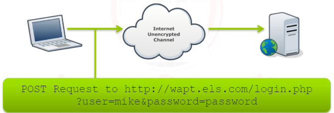
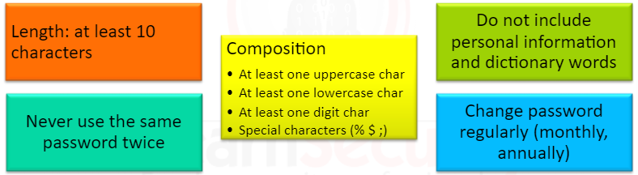
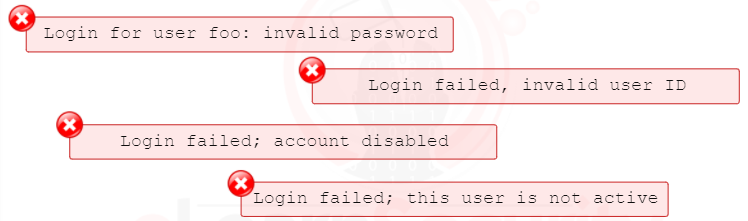
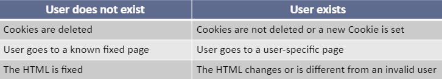
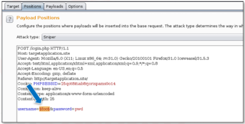
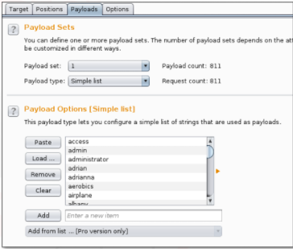
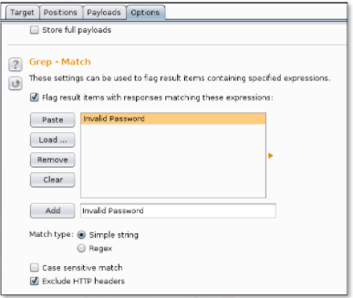
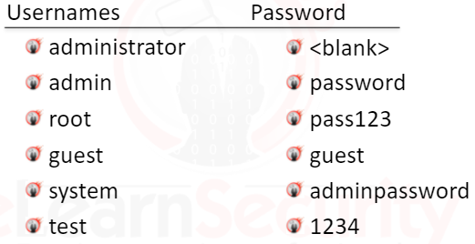
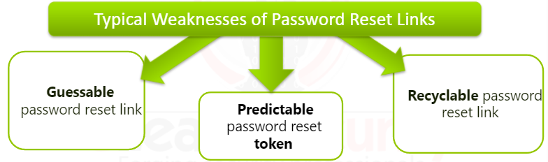
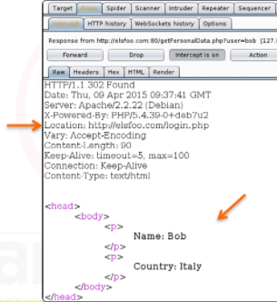

# Authentication 
is the process of verifying **who you are**

 

# Authorization
is **what you are able to do** ; authorization attacks have to do with accessing information that the user does not have permission to access.

**Example** : Admin vs Normal User

 

# Attacks
If the channel is not encrypted, an attacker, acting as a **man-in-the-middle** , can steal all the user’s providedinformation, including credentials.

A simple password can be easily guessed; likewise, even a short password with a special character can be easily **brute-forced**. A long password can be guessed, if it is a dictionary word, using a **dictionary attack.**

 

# Wordlist

The following are some resources of common wordlists:

**Openwall**

**Seclist**

**SkullSecurity**

 

# Defending 

A strong password policy should let the user choose his password while adhering to the following rules:

**A typical example of good system design is a system that:**

Adds an increasing delay after each failed login attempt**

After 3 failed attempts show a CAPTCHA puzzle

After 10 failed attempts, it locks the user for a certain amount of time

 

# Bad Design

All of these messages reveal that the provided user is correct.

 

# Enumeration

Some applications may not display the previous messages but have a distinct behavior depending on user existence. An attacker that enumeration. The following are some examples: identifies these behaviors may attack the web app via user

Most of the time, when a user exists in the database there will be more processing; for example:

**User does not exist in the DB** show error + abort

**User exist in the DB** : retrieve user, calculate password, check if the password match

 

# Advantage of user enumeration
Once this information is available to the attacker, he can perform any attack requiring the username component, such as:

A **dictionary** or **brute-force** attack against the password to discover the user's password

A **password reset**  for that user if the system suffers from aweakness in the password reset feature.

We can automate this username enumeration process with tools such as:

**Burp-suite**  with intruder feature

**Hydra**

 

# Burp-Suite Intruder

 

# Default Credentials

Publicly known default credentials can quickly result in compromise

Testing for default credentials requires two simple steps:

Identify all the components of the target website that may require credentials

Search for default password against the components identified

In other cases, a web developer could create test user accounts and forget to delete them.

 

# Reset Password

 

# Insecure Direct Object References

http://taxes-are-beautiful.yeah/report.php?**id=123**

changing the id number to access other information

 

# Missing Function Level Access Control

http://mysite.site/**admin/manage.php**

non admins should not have access to a page like this

 

# Example of vulnerable web app

Let’s suppose there is a web application requiring credentials at the following URL: http://www.elsfoo.com/login

If the user provides correct credentials, they will be redirected to the page (containing protected contents)

http://www.elsfoo.com/index.php?**auth=TRUE**

If the user provides no credentials or incorrect credentials, they will be redirected to the page (containing public contents)

http://www.elsfoo.com/index.php?**auth=FALSE**

**auth** is used to indicate whether the user is authenticated or not. So An attacker can easily change the parameter auth to *TRUE* since the web app considers only the **auth** paramerter to determine if a request is authenticated or not, the attacker will be able to access the protected contents.

*OR*

**Cookie** based64 value encoded can be used to define a user

    cookie : user= MQ==

so by changing the value of user from 1 ( ***MQ==*** ) to 2 ( ***Mg==*** )  we can be a new user

 

# Incorrect Redirection

The user requests protected contents at the following page:

http://www.elsfoo.com/getPersonalData.php?**user=bob**

Because the user is not authenticated, he or she will receive an HTTP response including the following header: 

Location: http://www.elsfoo.com/login

The user’s browser will analyze the header of the HTTP response and will perform a new **GET**  request to the new page (**login**) without showing the content body of the first request.

The web browser, after receiving the HTTP response with a **Location**  header, will not process the rest of the HTTP response and will issue a new HTTP GET request to the new page (**/login**)

The web browser will not show the body of the HTTP response if it contains a **Location**  header, but this does not mean that the body is not there.

It could actually have been received by the client, and it can contain useful information for a malicious user or a penetration tester; this happens because the developer has forgotten to terminate the server script execution right after the redirect.

a user is requesting getPersonalData.php to retrieve personal data of the user bob

the web browser automatically redirects to the login page

The **Location**  header will be used by the browser to perform a new HTTP request and ignore the body of the old one. 

So, by using a proxy (**Burp-suite**), an attacker can easily see protected contents; in this case, the personal data of the user Bob was obtained.

**Solution**: A web developer using a redirect to protect content must remember to terminate the script execution after inserting the redirect statement.