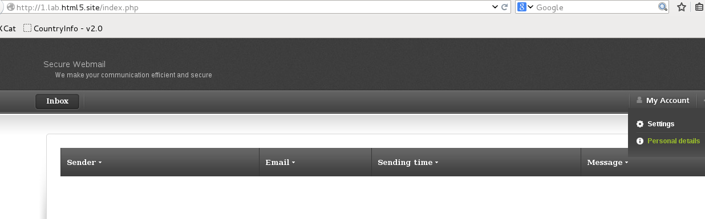
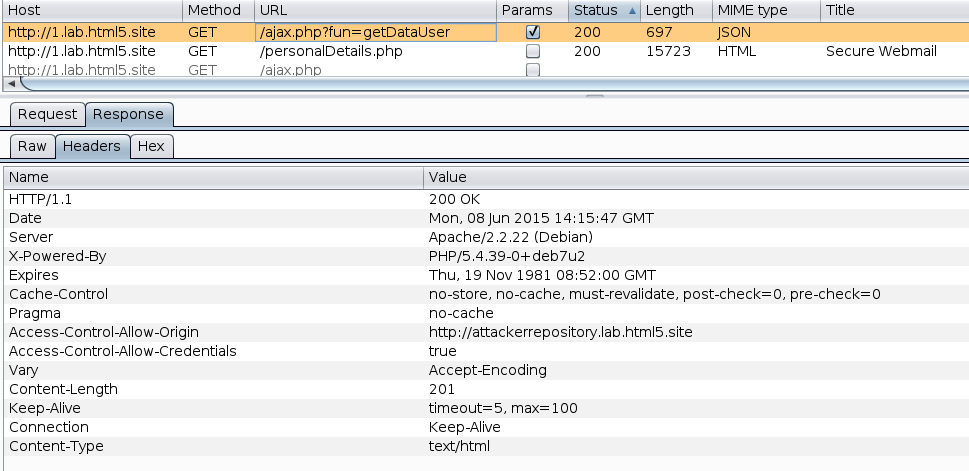
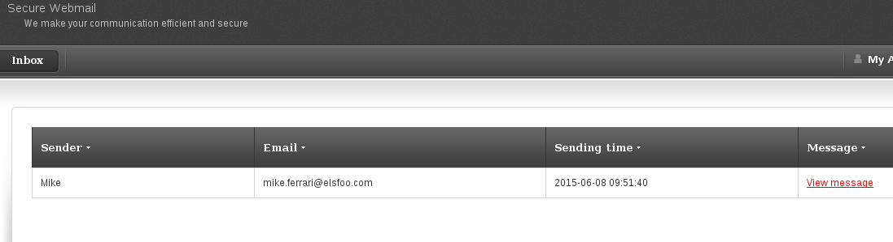
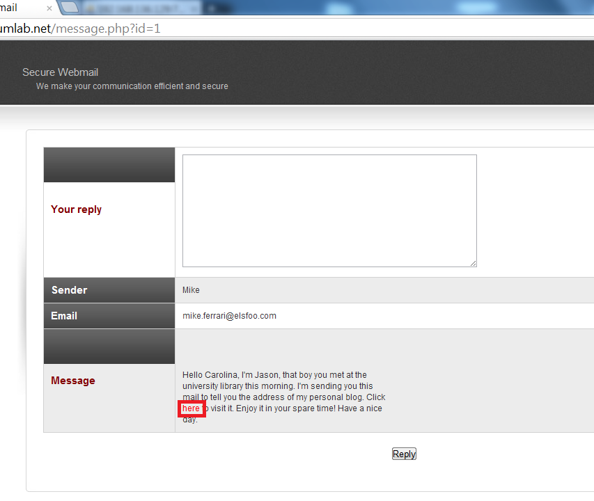
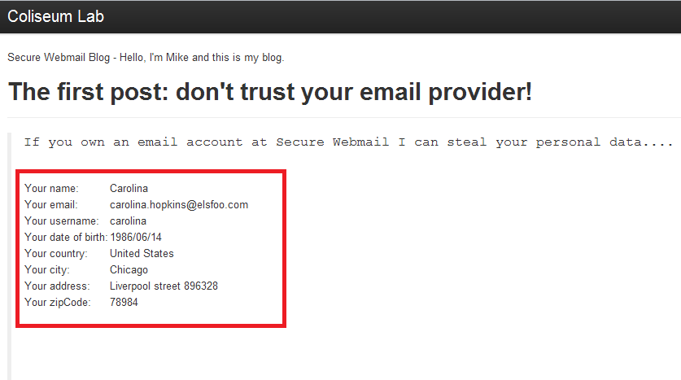

# Lab #1 - Attacking HTML5 - 1

Start Burp proxy and enable it to intercept all of the HTTP requests (and their responses) coming from your browser. Click the My Account button, followed by the Personal Details button.

Burp proxy will intercept and display a critically interesting response

The HTTP GET request to the URL ajax.php?fun=getUserData gets the current user's data. You can see that the related HTTP response contains two interesting headers:

    Access-Control-Allow-Origin:
    http://attackerrepository.lab.html5.site

This header will allow Ajax requests originating from the blog site to read content from the page ajax.php.

    Access-Control-Allow-Credentials: true
This header will allow Ajax requests to read protected content from the page ajax.php.

The page ajax.php is vulnerable because it allows cross-origin requests originated from the blog site (that is under the control of the attacker) to access the visiting user's protected. An attacker can use this vulnerability to steal the user's data.

The attacker needs to build a malicious web page within the blog origin (http://attackerrepository.lab.html5.site). After that, he must get his victim to visit his malicious page.

Let us assume that the attacker's blog already exists and is available here:

    http://attackerrepository.lab.html5.site/cors/190/index.php

The attacker has included JavaScript code, which performs a cross-origin Ajax request with the singular purpose of stealing his victim's data.

Let us look at a simple example of a malicious cross-site Ajax request:

    //Code on origin http://attackerrepository.lab.html5.site 
    $.ajax({ 
        url: "http://<secureWebmail>/ajax.php?fun=getDataUser", 
        crossDomain : true, 
        type : "get", 
        xhrFields: { 
        withCredentials: true
    }, 
    success: function (data) { 
    // Victim data processing
    } 
    });

Once the malicious page is ready, the attacker invites his victim to visit his blog. For example, a simple method would be: the attacker could send a message to the victim through Secure Webmail and invite him to visit his blog.

When the victim visits the blog, the JavaScript code above will be run within the context of the victim's browser. 

We have prepared a malicious message to be sent to Carolina (acting as the victim) by Mike (acting as the attacker).

The message invites Carolina to visit Mike's blog:

When Carolina opens the blog link, the browser will perform a cross-origin Ajax request (to the page ajax.php) and will steal all of her personal data.

