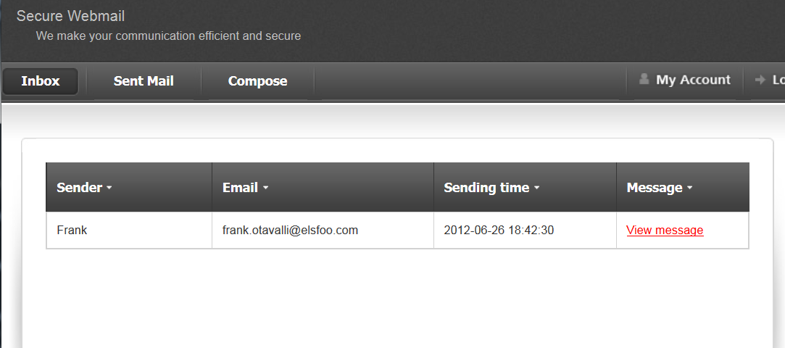
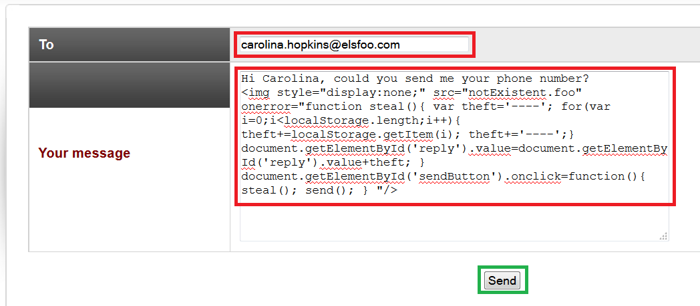
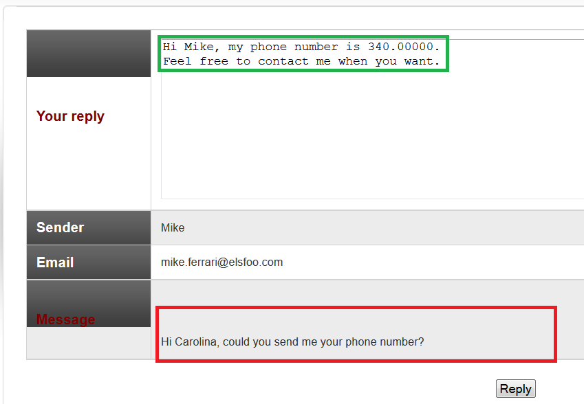
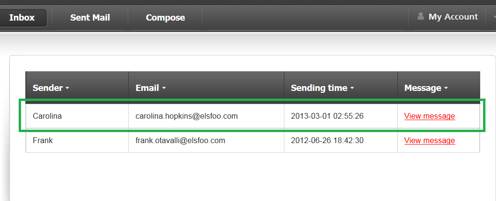
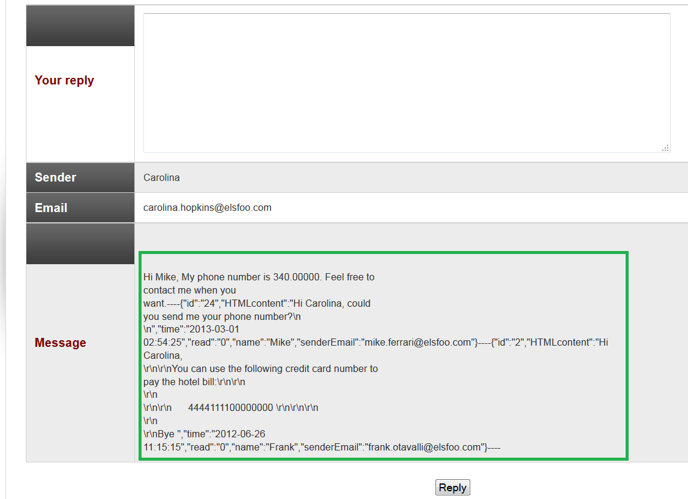

# Lab #2 - Attacking HTML5 -2
This type of attack requires the attacker to interact in some manner with the victim.

The web application will display your inbox.

If you analyze the source code of the index page (index.php), you will notice that the localStorage object has been used to store all received messages.

The following JavaScript code (available in the index.php page) shows how the messages are retrieved (via an Ajax request) and how the messages have been stored (using the localStorage interface):

    $.ajax({
        url: "ajax.php?fun=getList",
        async: false,
        success: function (data) { 
        . . . 
        . . . 
        for (var i=0; i<data.emailList.length; i++) {
            . . . 
                    // Add items into local storage
                    var encodedItem=JSON.stringify(data.emailList[i]);                      localStorage.setItem(i,encodedItem); 
            } 
        } 
    });

Your next step will be finding out a vulnerability that could help you (acting as the attacker) to access the localStorage object related to your victim.

Secure webmail is vulnerable to XSS (Persistent XSS). The web application doesn't perform any sanitizing on the sent message text. To test the vulnerability, you can create a malicious message and send it to yourself.

Let us choose the following payload:

    

## How to build the malicious message

    Hi Carolina, could you send me your phone number?
    

## Final Payload

    Hi Carolina, could you send me your phone number? 

- The JavaScript code highlighted in the lines 4-8 will be used to steal messages from the victim's inbox.

- The JavaScript code highlighted in line 9 will be used to append the stolen messages to the actual message that the victim responds with.
- The JavaScript code highlighted in lines 12-13** will be called when the victim presses the Reply button. This code makes use of a send() function already built into the web application. The send() function performs the sending operation, but the message written by the victim will be changed by the attacker's payload (code in line 9) **before the victim presses the Reply button.

## Exploitation (Attacker's point of view - part2)

All the messages available in Carolina's inbox have been sent through her last reply thanks to your malicious message.

