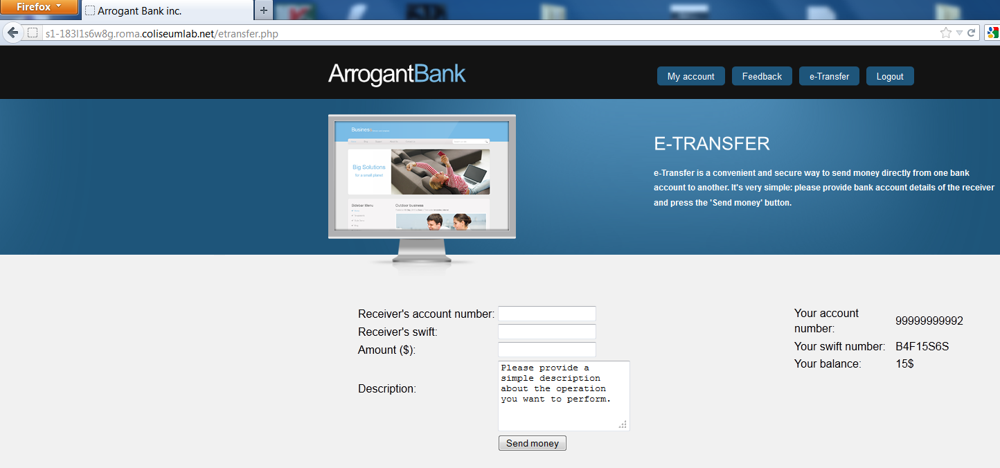
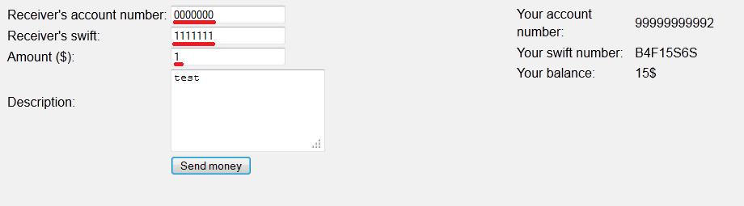
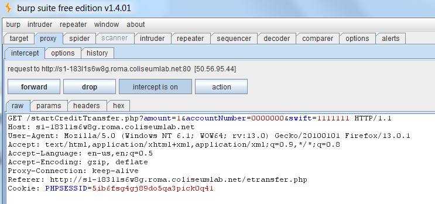
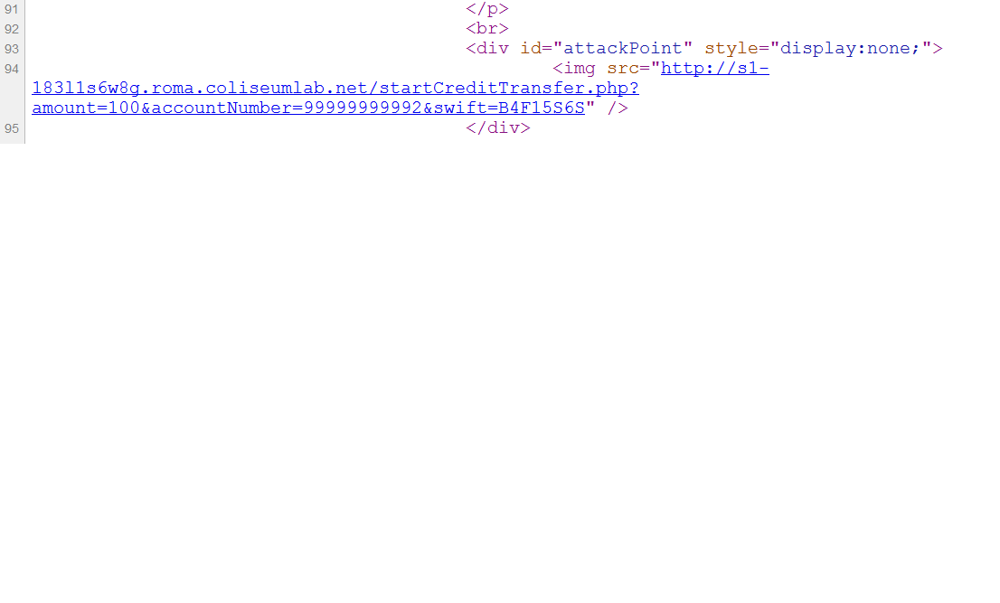
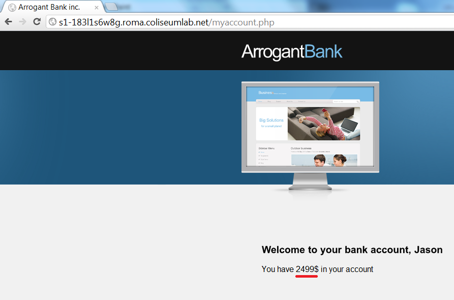

**CSRF** is a vulnerability where a third-party web application is able to perform an action on the user's behalf.

It is based on the fact that web applications can send requests to other web applications, without showing the response.

Bob (victim) visits **amazon.com**, logs in, then leaves the site without logging out.

Bob then visits **foo.com** (malicious website) which inadvertently executes a request to **amazon.com** from bob's browser (such as buy a book)

The victim browser sends this request, along with all the victim cookies. The request seems legit to **amazon.com**

    <html>
     <body>
           
     </body>
    </html>

Since Bob is still logged in on Amazon, the request goes through,and the money is withdrawn from his account for the purchase of the book

This is because Bob already has an authenticated session open on Amazon.

 

### Solution

The most common protection mechanism against CSRF exploit is to use a **token** to validate the request.

 

# Lab Example

Open the attacker browser (for example Mozilla) and go to the Arrogant Bank home page. Login with the following credentials:

- Username: mike

- Password: ABC7d8z1

You will notice that ArrogantBank is offering a new service: e-Transfer. With this feature, a logged user will be able to send money to another customer of the same bank.

Let us examine how the service works. To do this, we will enable Burp proxy to intercept all the HTTP requests leaving the browser. After that, we will start a test money transfer, and we will observe which parameters are sent by the browser with the requests.

After pressing the submit button Burp proxy will intercept the following request:

Please note that money transfer is performed using an HTTP request and that the following parameters are embedded in the URL

- accountNumber - receiver's account number

- swift - receiver's swift code

- amount - amount of money to transfer

There is no unpredictable token sent with the request so you can conclude that web application is vulnerable to CSRF in the script startCreditTransfer.php.

 

## Building the exploit
The attacker must build a payload to force the victim into sending him money. Therefore, the payload will include the attacker account number and the desired money:

- accountNumber : 99999999992

- swiftCode : B4F15S6S

- amount :

According to the web application logic, the payload will be embedded in the following URL:

    http:///startCreditTransfer.php?amount=100&accountNumber=99999999992&swift=B4F15S6S

By simply loading that URL, an authenticated victim will send money to the attacker.

There are many ways to let a logged user load a URL. The most trivial is to send a link to the victim in hope that he will click on it.

In this case, the victim could become suspicious, as he would see the webpage of ArrogantBank with the result of the money transfer.

Another, better and stealthier, way to achieve the same goal is to embed the CSRF payload URL in the SRC attribute of an Image within an HTML page. Same-origin does not apply; we are just requesting an external resource without having to read the response.

The Image tag can be embedded in any page that the victim trusts (Facebook, Third party Forums, Your website)

 

## This method works best for a number of reasons:

 

CSRF payload with the suspicious request won't appear in the link that we send to the victim

The victim doesn't see the output of the request

Higher chances that the victim will visit the page with the Image than a link that includes long and suspicious content

Therefore, the attacker can use a personal website under his control on a different domain to host the following malicious code:

    
  
    

For educational purposes, we have already created a feedback message from an attacker. This message has a link to a page that embeds the above image. When you visit the feedback page you should see it:

**The My site input field of the form was used to include the link.**

 

### Running the exploit
 

Now let us pretend to be a victim. Open a second browser (for example Google Chrome), and log in with the following credentials:

- Username: jason

- Password: 8AqL168a

Note that you should have $2599 in your account. Whatever the amount is, please note it down.

Now move to the feedback area. Please click on the link to the malicious page.

When you do, you will land to the attacker's web page that embeds the malicious hidden image. You can verify so by inspecting the web page source code:

By now, the Arrogant web server has elaborated the money transfer request in the background as if it had been initiated voluntarily by the victim.

Now visit your Myaccount page again and verify your total money.

It should be $100 less than before. Where did those dollars go?

You can just log in again as Mike and see

**The attack has been completed!**

Note that if web application had had an anti-CSRF token, the attacker could not have built the URL payload without guessing that token. Any unpredictable token would have made the application safe from CSRF.

# Challenge One

Link was being fetched each time any user loads the webpage, so you inject a payload in the link field to do requests on behalf of the victim.

    http://1.challenge.session.site/process_post.php?title=admin&body=admin&pic=http://google.com

