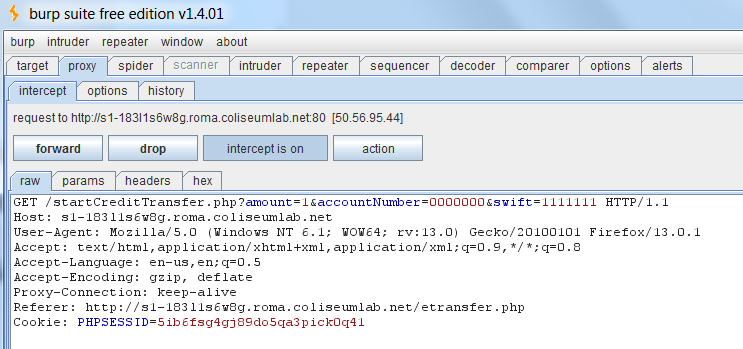

**CSRF** is a vulnerability where a third-party web application is able to perform an action on the user's behalf.

It is based on the fact that web applications can send requests to other web applications, without showing the response.

Bob (victim) visits **amazon.com**, logs in, then leaves the site without logging out.

Bob then visits **foo.com** (malicious website) which inadvertently executes a request to **amazon.com** from bob's browser (such as buy a book)

The victim browser sends this request, along with all the victim cookies. The request seems legit to **amazon.com**

    <html>
     <body>
           
     </body>
    </html>

Since Bob is still logged in on Amazon, the request goes through,and the money is withdrawn from his account for the purchase of the book

This is because Bob already has an authenticated session open on Amazon.

 

### Solution

The most common protection mechanism against CSRF exploit is to use a **token** to validate the request.

 

# Lab Example

Login with the following credentials:

- Username: mike

- Password: ABC7d8z1

You can see that checking account information is stored in JavaScript variables, provided by the URL balance.php. This resource acts as a JavaScript library file so that it can be imported by any web page regardless of its domain origin.

## Building the exploit

The attacker can build an html page in a domain under his control. This page will access the JavaScript variables owned by the unlucky bank customer.

The exploit code will have a similar structure:

Note that the JavaScript variables can be loaded only if a logged user loads the malicious page. Unauthenticated users will get an empty file.

To be sure the page is loaded by an authenticated user, the attacker can use the Feedback area to spread a link to his malicious web site. A customer opening that link will become a victim.

## Running the exploit

Open a second browser (for example Google Chrome), and login with the following credentials:

- Username: jason

- Password: 8AqL168a

Go to the feedback area and open the link provided by Mike.

The browser will load the JavaScript variables related to the logged session and will steal checking account information:

For education purposes, the malicious page will show you all the stolen information. In a real-world attack, this information is secretly retrieved and collected by the attacker.