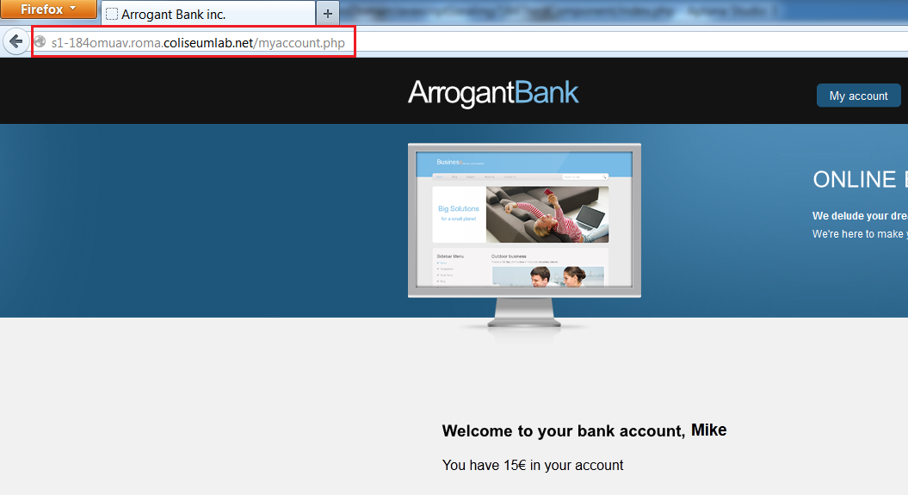
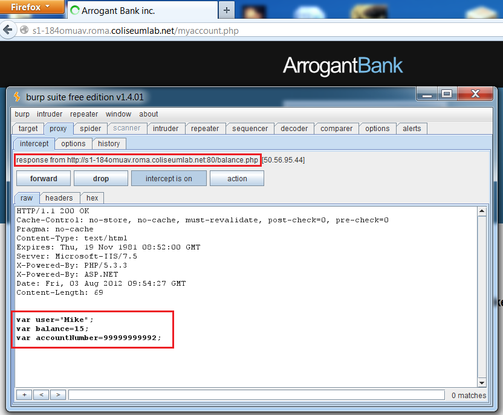
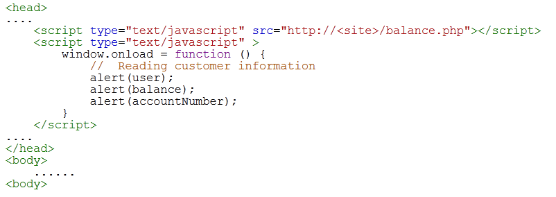
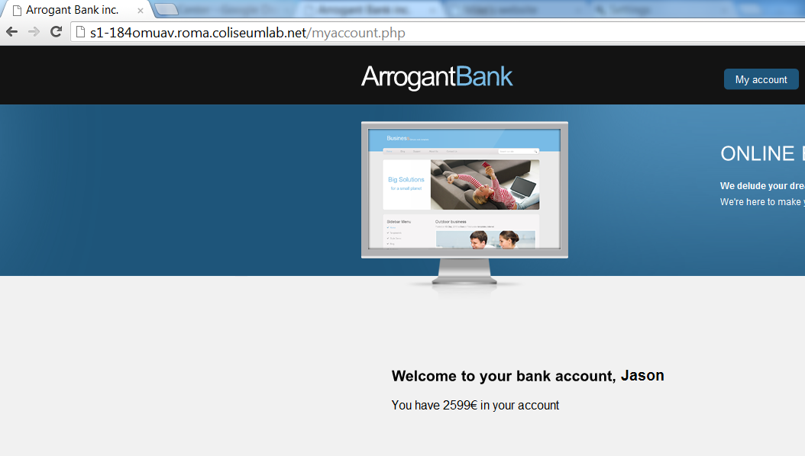
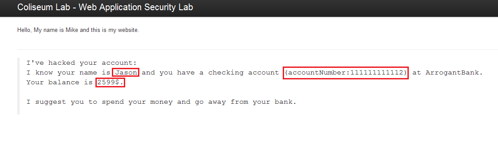

# Lab Example

Login with the following credentials:

- Username: mike

- Password: ABC7d8z1

You can see that checking account information is stored in JavaScript variables, provided by the URL balance.php. This resource acts as a JavaScript library file so that it can be imported by any web page regardless of its domain origin.

## Building the exploit

The attacker can build an html page in a domain under his control. This page will access the JavaScript variables owned by the unlucky bank customer.

The exploit code will have a similar structure:

Note that the JavaScript variables can be loaded only if a logged user loads the malicious page. Unauthenticated users will get an empty file.

To be sure the page is loaded by an authenticated user, the attacker can use the Feedback area to spread a link to his malicious web site. A customer opening that link will become a victim.

## Running the exploit

Open a second browser (for example Google Chrome), and login with the following credentials:

- Username: jason

- Password: 8AqL168a

Go to the feedback area and open the link provided by Mike.

The browser will load the JavaScript variables related to the logged session and will steal checking account information:

For education purposes, the malicious page will show you all the stolen information. In a real-world attack, this information is secretly retrieved and collected by the attacker.