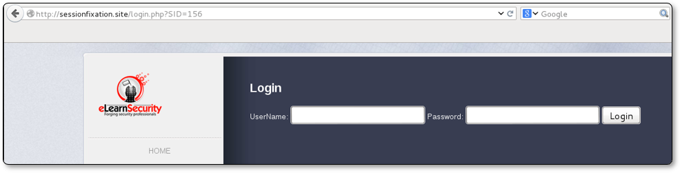
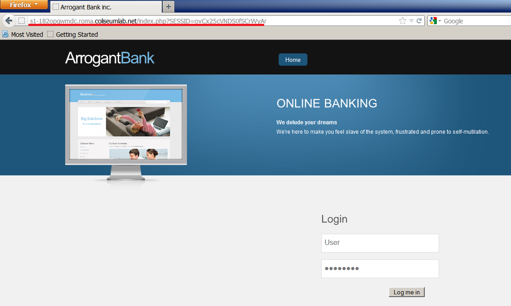
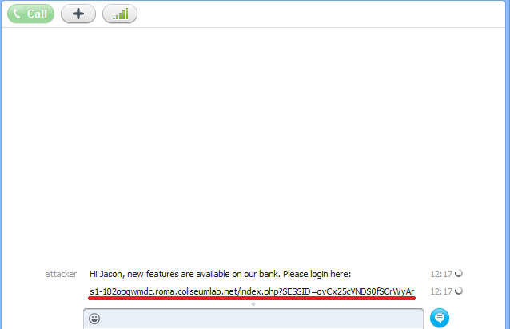
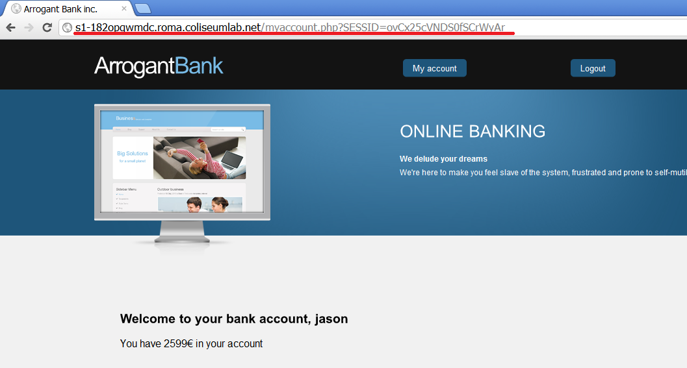

**Session fixation** is a session hijacking attack where, as the name suggests, the attacker fixates a **sessionID** and forces the victim to use it.

### The attack can be divided into two phases:

- The attacker obtains a valid sessionID
- The attacker forces the victim to use this sessionID to establish a personal session with the web server

 

# Example

Let’s see what would happen with a vulnerable application that does not refresh the **sessionID**  after the user logs in and also propagates the users sessionID via URL. In the following screenshot, we can see that the sessionID is set in the parameter **SID** within the **login.php** page:

**/login.php?SID=156**

Knowing that, the attacker creates the following link and sends it to the victim

    http://sessionfixation.site/login.php?SID=300

Once the victim opens the link, the sessionID will be set to **300**.

Since the Web Application recycles the sessionID (even after the user logs in), the attacker is able to impersonate the victim session by changing his sessionID to by changing his sessionID to **300**

 

## Solution

Theoretically, the best technique to defend your application from Session Fixation attacks is to generate a **NEW** *sessionID* after any authenticated operation is performed.

 

# Lab Exercise

As the attacker, open the browser (for example Mozilla) and go to the main page of the web application. You will notice that the URL of the index page includes the following string:

    SESSID = <randomToken>

As you can see, SessionID is embedded in the URL, and it has been assigned by a web server regardless of the unauthenticated status of the visitor.

After login, SessionID is not updated, so our web application is vulnerable to Session Fixation attacks.

What we need to do is to force the victim to login to the vulnerable website using a URL that contains an arbitrary sessionID.

    SESSID=ovCx25cVNDS0fSCrWyAr

We can send it by e-mail, social networks, or by any other means.

once the user uses this link to login, the sessionID will be owned by the victim and the ID is known to the attacker

You, as the attacker, can just reload the page using the fixated session and verify that you are now into Jason's account.