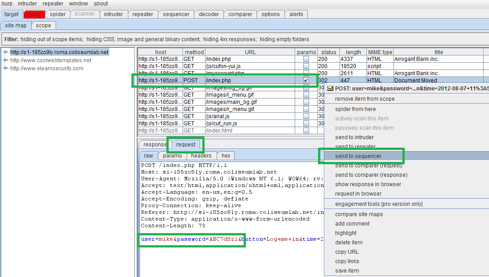
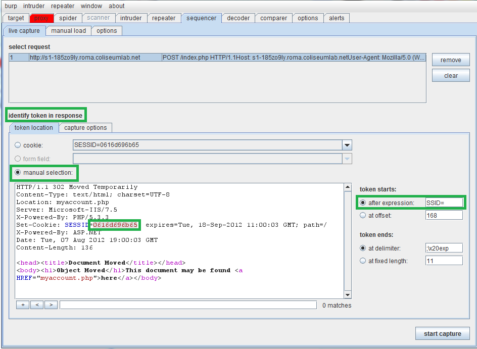
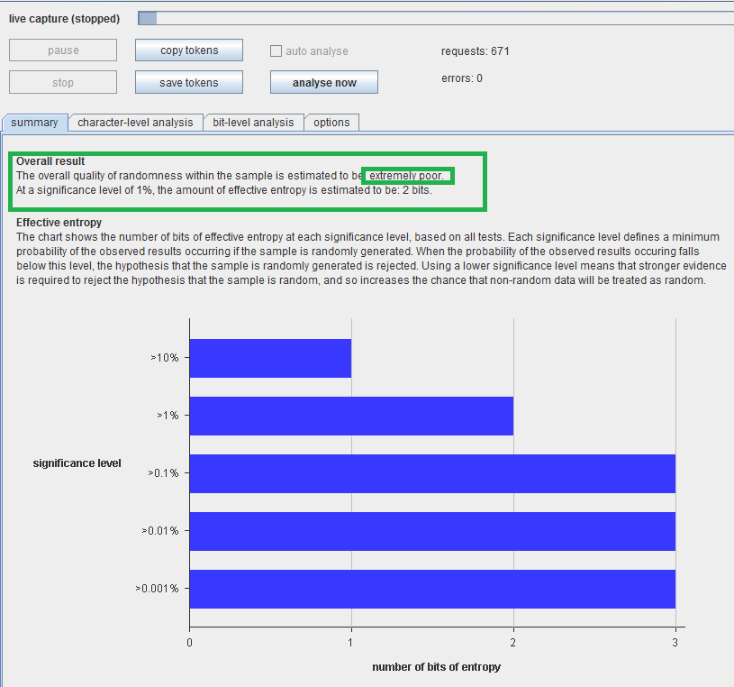
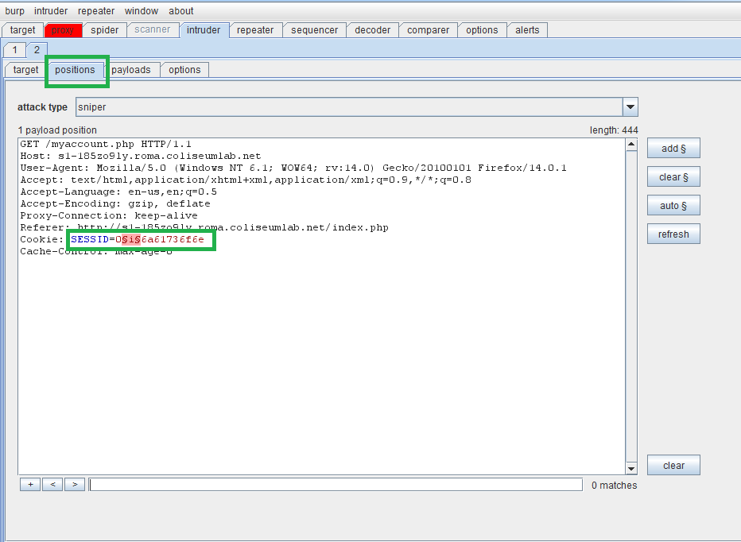
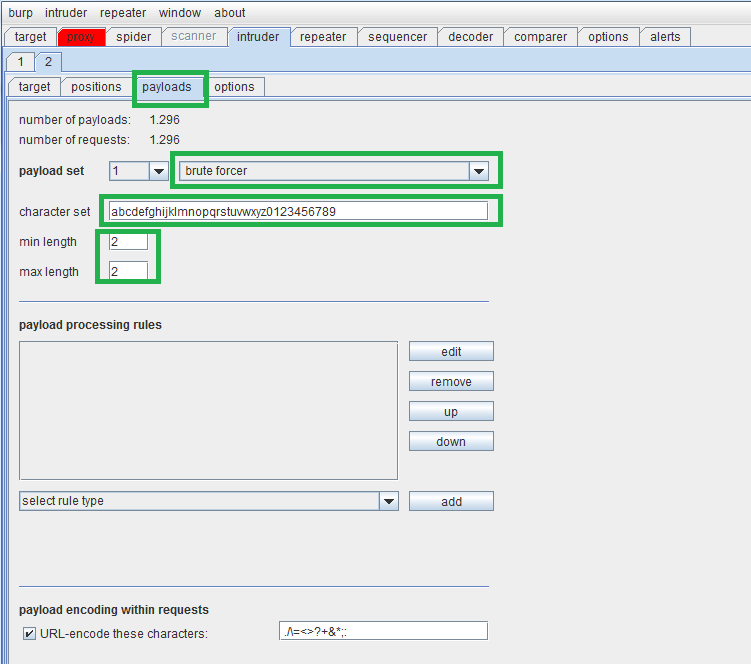

Open the attacker browser (for example Mozilla) and go to the main page of the web application. Login with the following credentials:

- Username: mike

- Password: ABC7d8z1

Web application assigned the following sessionID: 0116d696b65

Let us analyze the goodness of the session IDs assigned by the web application using a tool like Burp Sequencer. Our goal is analyzing possible correlations of sessionIDs.

Identify the login request within Burp and send it to Sequencer

Now we will work on the HTTP response that will set our session cookie. We will do a manual selection, highlighting the sessionID within the Set-Cookie header in the response. Sequencer will immediately identify a pattern to extract the sessionID.

At this point, we can click on Start capture (screen above) to perform a number of logins and to obtain a corresponding number of session ID's to be analyzed. A minimum of 100 tokens is necessary to perform an analysis.

Click on Analyze now once done. This will be the result:

Of course, the randomness of the session ID's is recognized to be extremely poor, and there's really no entropy. Please note that for more reliable statistical analysis you will have to collect much more than 135 tokens (around 1000 begins to be acceptable).

The chart shows that chars at the second and third position are generated in a random manner, differently from the others assuming always the same values.

**0116d696b65**

We can conclude that sessionIDs include a fixed component (9 chars) and a random component (2 chars).

At first sight, it seems to be a result of a well-known function. If you analyze it deeper, you will find out that it represents the hexadecimal conversion of the string 'mike.'

Now we can depict the structure of our sessionID:

0

So, fixed a username, only two chars are effectively generated in a random manner. However, if the attacker does not know the username of the logged victim, the previous statement is wrong!

As the attacker now, you must guess a valid session identifier used by another logged user. If you know the victim username, the attack will be fast because the sessionID has a fixed component depending on the username. And you know it, it's jason.

**'jason' converted to hexadecimal is 6a61736f6e**

Therefore, the sessionID has this format:

**0XY6a61736f6e**

We can use Burp Intruder to start this attack. We will use the myaccount.php page as target because the HTTP response from this page returns the status code 200 if the request has been authenticated (so with a right sessionID) and the status code 302 otherwise.

Burp intruder will perform HTTP requests to the myaccount.php page specifying a different sessionID to each attempt.

Now start the attack.

Now Burp Suite is performing HTTP requests to the myaccount.php page.

When all the HTTP requests have been performed, analyze the responses. All the responses will have a status code 302 except the authenticated request with status code 200.

Therefore, you will analyze only the HTTP request returning a 200 status code. You will see that the guessed sessionID is **0236a61736f6e.**